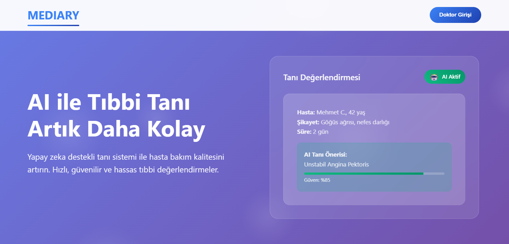
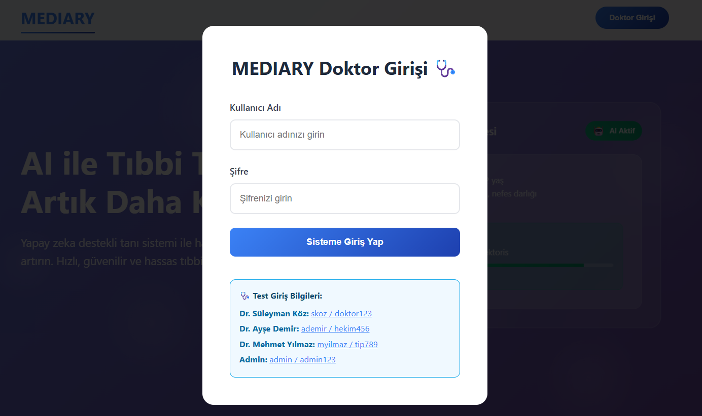
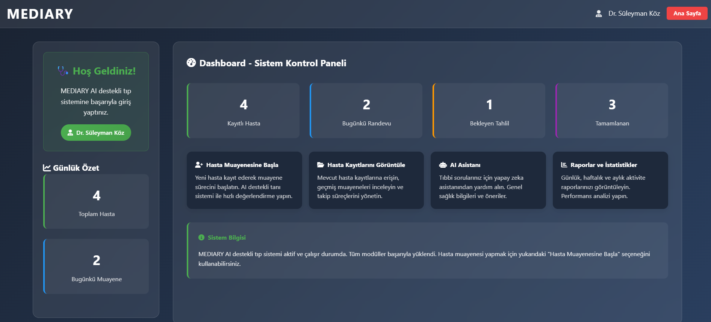
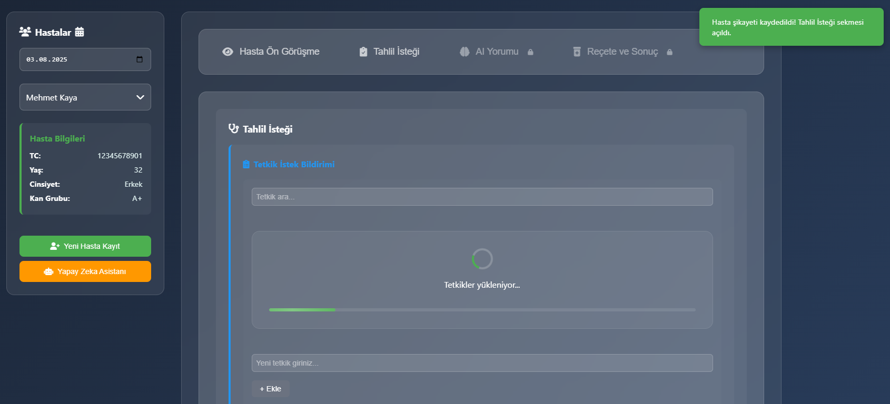
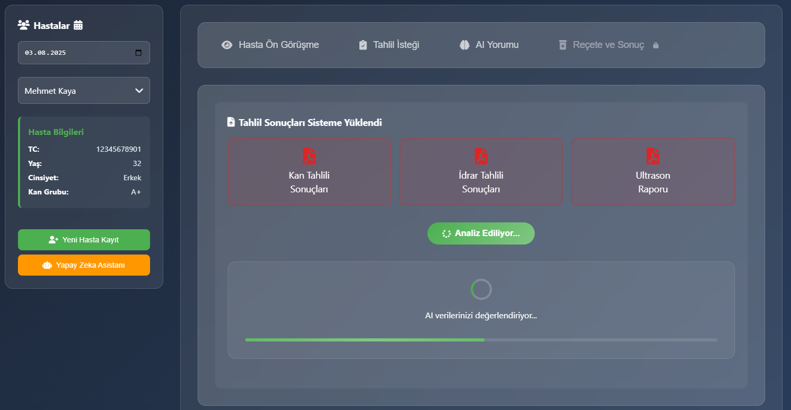
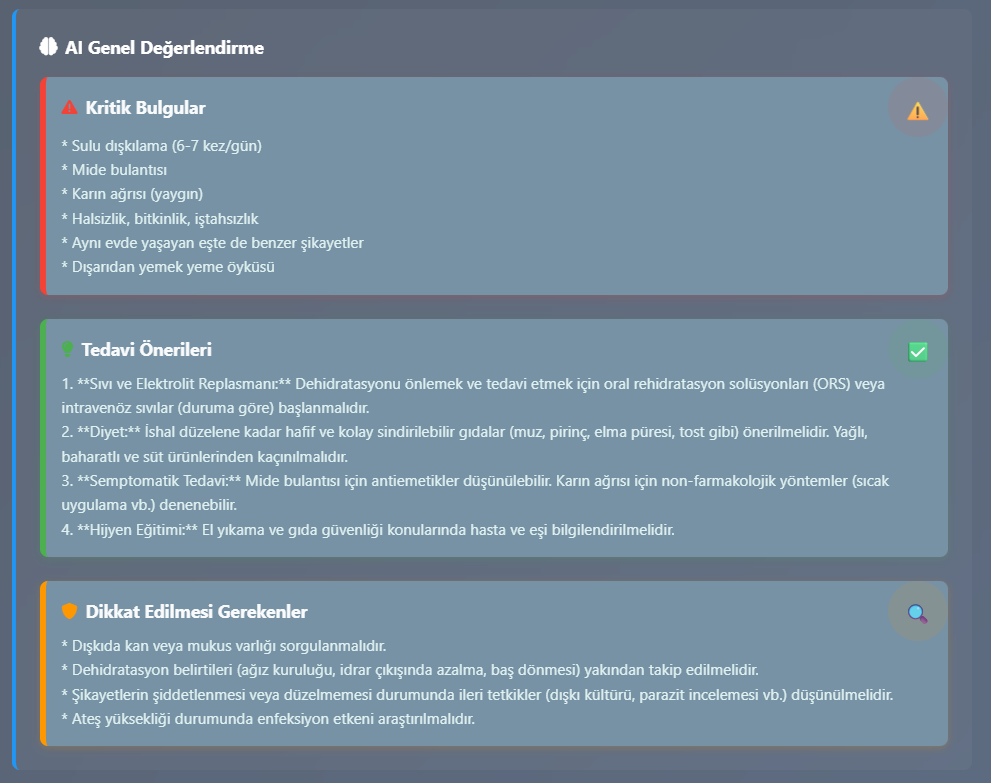

# Project: MEDIARY

<div style="text-align: left;">
  
</div>

## Introduction

> The aim is to automate processes such as diagnosing based on patient history, recommending tests, interpreting results, and providing personalized health assessments with the support of artificial intelligence.
>
> The project aims to provide clinical decision support for doctors, offer preliminary information to patients, and reduce the workload within the healthcare system.
>
> In the initial phase of the project, the data collection process has been focused on the field of Internal Medicine; therefore, diseases specific to this area will be prioritized for evaluation. In later stages, data will also be gathered from other medical specialties, aiming to obtain stronger insights into a broader range of health conditions.


## Project Content
1. [Installation Steps](#installation-steps)
2. [Pipeline](#pipeline)
3. [Application UI](#application-ui)
3. [Structure](#structure)
4. [API Endpoints](#api-endpoints)
5. [Product Features](#product-features)
6. [Target Audience](#target-audience)
7. [Team Details](#team-details)
8. [Sprint Details](#sprint-details)


## 🚀 Installation Steps

You can run the project by following the steps below:

```bash
# 1. Clone repository (optional)
git clone https://github.com/dvaser/Mediary.git
cd Mediary

# 2. Create a virtual environment (.venv)
python -m venv .venv

# 3. Activate the virtual environment (.venv) 
    # Windows (PowerShell)
    .venv\Scripts\Activate.ps1

    # If you get a script execution error in PowerShell:
    Set-ExecutionPolicy -ExecutionPolicy RemoteSigned -Scope CurrentUser

    # Windows (CMD)
    .venv\Scripts\activate.bat

    # Windows (Powershell)
    .venv\Scripts\activate

    # macOS / Linux
    source .venv/bin/activate

# 4. Install the required packages
pip install -r requirements.txt

# 5. Start the application
python app.py

# 6. Log out of the virtual environment (.venv)
deactivate

# (In addition) Transfer libraries used (requirements.txt)
pip freeze > requirements.txt
```

## Pipeline
```
PDFChunker  --->  GeminiEmbedder  --->  ChromaDBWrapper  --->  Query + Gemini Answer
```

## Application UI

<div style="text-align: left;">
  
  
  
  
  
</div>


## Structure
```
MEDIARY/
│
├── .venv/                         # Virtual media folder
│
├── data/                         
│   ├── chromaDB_medical_v2/       # ChromaDB version 2 for medical data
│   ├── chromadb_persist/          # ChromaDB database files
│   └── source/                    # Source files (e.g. PDF, raw data)
│
├── logs/                          # Folder where log files are kept
│
├── model/
│   ├── pipeline/                  # Pipeline modules
│   │   ├── __pycache__/           # Python cache files
│   │   ├── chroma.py              # ChromaDB related code
│   │   ├── gemini.py              # Gemini embedder and answer generator
│   │   ├── pdf_prep.py            # PDF shredder module
│   │   └── rag_pipeline.py        # RAG pipeline main handler
│   │
│   ├── utils/                     # Helper modules
│   │   ├── __init__.py           
│   │   ├── ask_question.py        # Query functions
│   │   ├── chromaDB_query.py      # ChromaDB query module
│   │   ├── config.py              # Configuration settings
│   │   └── setup_index.py         # Index setup module
│
├── project/                       # Project specific content
│   ├── img/                       # Images
│   └── markdowns/                 # Markdown documents (e.g. sprint reports, team details)
│
├── static/                        # Web static files
│   └── index.html                 # Main HTML file
│
├── .gitignore                     # Git ignore settings
├── app.py                         # Web application main file
├── config.ini                     # Configuration file
├── README.md                      # Project description
└── requirements.txt               # Python package requirements
```

## API Endpoints

### AI-Based Test Recommendation Service – Stage 1: Based on Patient History
This endpoint analyzes a given patient history and recommends relevant laboratory and imaging tests using AI. It is typically used during the initial stage of clinical assessment.

```http
POST /api/ask_stage1
```

| Parameter | Type    | Required | Description                                 |
|-----------|---------|----------|---------------------------------------------|
| `api_key`   | string  | Yes      | A valid API key for access.                 |
| `question`  | string  | Yes      | Patient history or complaint text.          |


```
Example Response:
{
  "recommended_tests": [
    "Complete blood count (CBC)",
    "Liver function tests",
    "Abdominal ultrasound"
  ]
}
```

### AI-Based Clinical Assessment – Stage 2: Patient History + Test Results
This endpoint analyzes a patient's complaint together with their test results, providing an AI-powered clinical interpretation, critical findings, treatment suggestions, and external model insights. It is typically used during the diagnostic and planning stage.

```http
POST /api/ask_stage2
```

| Parameter | Type    | Required | Description                                 |
|-----------|---------|----------|---------------------------------------------|
| `api_key`   | string  | Yes      | A valid API key for access.                 |
| `question`  | string  | Yes      | Combined input: patient history + test results.          |


```
Example Response:
{
  "ai_summary": "The patient presents with heartburn, constipation, and poor pancreatic function. These findings may suggest chronic pancreatitis.",
  "critical_findings": [
    "Heartburn",
    "Constipation",
    "Poor pancreatic function"
  ],
  "treatment_recommendations": [
    "Evaluate for chronic pancreatitis based on symptoms and findings.",
    "Order tests to assess pancreatic exocrine and endocrine functions (e.g., fecal elastase, direct function tests).",
    "Use imaging (CT, MRI, MRCP) to evaluate pancreatic status (atrophy, calcifications, ductal dilation, stones, pseudocysts).",
    "Provide symptomatic treatment for heartburn and constipation."
  ],
  "cautions": [
    "Monitor for weight loss, steatorrhea, or diabetes, which may indicate exocrine or endocrine insufficiency.",
    "If pain is severe and affects quality of life, consider medical, endoscopic, or surgical pain management."
  ],
  "external_ai": {
    "model": "MedicalAI v2.1",
    "diagnostic_confidence": "65%",
    "risk_score": "Moderate",
    "recommended_protocol": "Pancreatic enzyme replacement + symptomatic management",
    "follow_up_duration": "3 months"
  }
}
```

## Product Features

> 🧠 **AI-Powered Diagnosis Prediction:** Utilizes patient medical history to predict potential diseases with high accuracy.  
>
> 🔬 **Test Recommendation System:** Suggests relevant diagnostic tests tailored to suspected conditions, streamlining physician approval workflows.  
>
> 📊 **Test Result Analysis:** Automatically compares test outcomes against standardized reference ranges and provides clinical interpretations.  
>
> 💬 **AI-Assisted Interpretation:** Converts complex medical data into clear, concise, and patient-friendly reports for easier understanding.  
>
> 🌐 **Web-Based Interface:** Intuitive input and output panels designed for seamless use by both patients and healthcare professionals.  
>
> 📁 **Comprehensive Database & Knowledge Mapping:** Integrates extensive disease-test associations and reference values to ensure clinical precision.

## Target Audience

* **Medical Students** – Enhance diagnostic learning through AI insights.  
* **Family Physicians & Internal Medicine Specialists** – Support clinical decision-making and patient management.  
* **Medical Secretaries & Allied Health Professionals** – Facilitate test ordering and result interpretation workflows.  
* **Healthcare Technology Developers** – Build upon an AI-driven medical platform for innovation.  
* **Health-Conscious Individuals & Curious Patients** – Empower personal health monitoring and understanding.


## Team Details

>  **[Click here to see team details](project/markdowns/team.md)**

## Sprint Details

>  **[Click here to see the sprint-1 workouts](project/markdowns/sprint/sprint-1.md)** 
>
>  **[Click here to see the sprint-2 workouts](project/markdowns/sprint/sprint-2.md)** 
>
>  **[Click here to see the sprint-3 workouts](project/markdowns/sprint/sprint-3.md)** 
