# Sprint 2

* **Sprint Notes:**
  * PDF data was processed using `Python`, and embedding operations were performed via the `Gemini API`.
  * An AI model was trained using the extracted data and integrated with the `RAG system`.
  * Frontend development was initiated, and basic pages were created using `Django`.
  * The team was divided into two groups: frontend and backend; daily meetings were held via `Google Meet`.
  * The RAG system was tested, and chunking and data retrieval methods were improved.
  * The project progressed as planned both technically and visually.

* **Expected point completion within Sprint:** `100 points`

* **Point Completion Logic:** The entire project backlog consists of '300 points'. Dividing this into three sprints, the first sprint was assigned '100 points' of workload. 

* **Daily Scrum:** 
 

  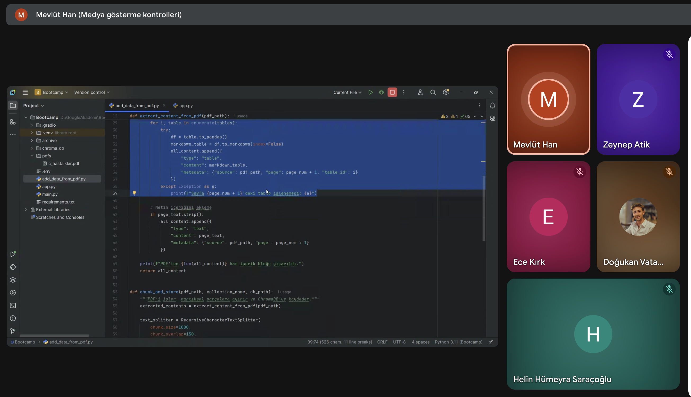

* **Meeting Dates:** `July 7nd,  July 14nd,  July 16nd,  July 20nd.`

* **Product Backlog URL:**
 

  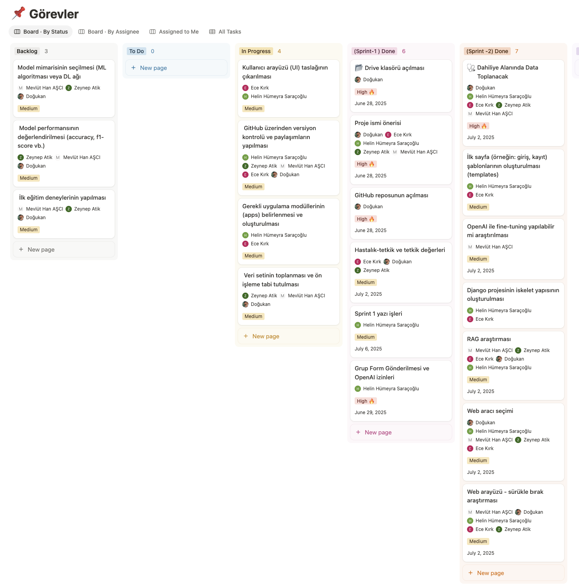

* **Sprint Review:**
  
  * The source PDF documents were processed using the Python programming language.
  * Integration with the Gemini API was established to extract data from these PDFs.
  * A model was trained using the processed data.
  * The trained model was integrated with the RAG (Retrieval-Augmented Generation) system.
  * Thanks to RAG, meaningful and contextually relevant results were obtained from the documents.
  * A frontend development process was initiated to present the model to users.
  * The Django framework, based on Python, was used for both frontend and backend development.
  * With Django infrastructure, the basic pages were created and the application's foundation was laid.

* **Sprint Review Participants:** `Doğukan Vatansever, Hatice Ece Kırık, Zeynep Atik, Mevlüt Han Aşcı, Helin Hümeyra Saraçoğlu.`
  
* **Sprint Retrospective:**

  * AI model training was initiated as planned, using the Gemini API and a document-based embedding structure.
  * The RAG system was integrated with the vector database and tested with user queries.
  * Team collaboration was strong, and tasks were completed efficiently through regular meetings.
  * The logo design process was started; several drafts were created and further development will continue in the next sprint based on feedback.
  * Development of the Mediary website began using the Django framework; basic pages such as the homepage and patient input interface were implemented.
  * Some challenges were encountered regarding the consistency of AI responses across different documents, but improvements in chunking and retrieval methods helped resolve these issues.
  * Overall, Sprint 2 progressed according to the planned roadmap, and the technical and visual foundation of the application was successfully established.

  
---
 

    
<h3>Backend</h3>

   
### Model Training
We utilized the Gemini AI infrastructure and implemented a RAG (Retrieval-Augmented Generation) system. The RAG structure works by vectorizing the documents we feed into the system and using these vectors to generate context-aware answers to user queries. Therefore, the first step was to integrate the RAG system into our model.

Three team members collaborated on the model training process. Each person built a RAG system on their local machine and performed the model training individually. After evaluating the outcomes from each system, the best-performing components were identified and merged to build a more robust and stable model.

* **Backend Developers:**
  * Zeynep ATİK
  * Mevlüt Han AŞCI
  * Doğukan VATANSEVER

  

  

  

  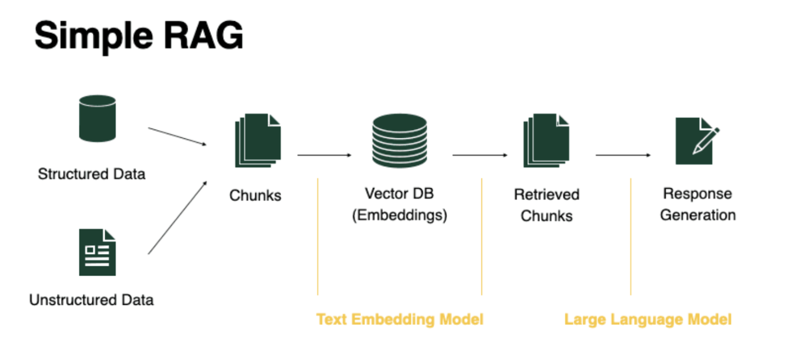

 
## RAG Pipeline – 4-Stage Process:

* This system is designed to split PDF documents into chunks, embed them into a vector database, and generate context-aware answers to user queries. The process consists of four main stages:

  

  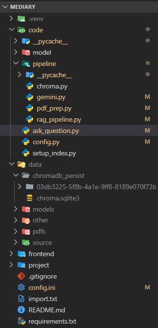

 

  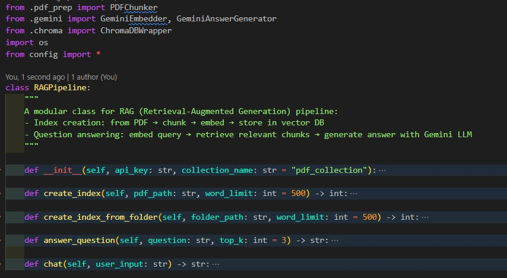

---
* **1. Chunking (Splitting the PDF)**
  
  * **Class:** `PDFChunker`
    
  * The PDF file is divided into chunks based on titles, headings, subtitles, and the overall text structure.
  * Each chunk is structured to carry meaningful information. This allows the model to provide more focused and accurate responses.

 

  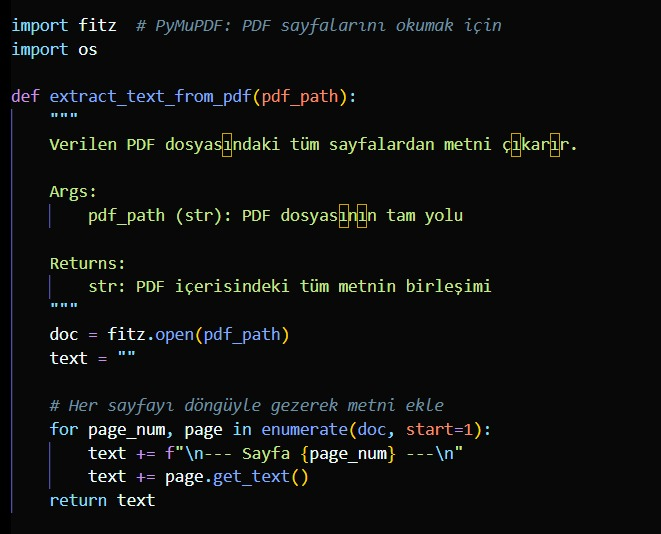

 

  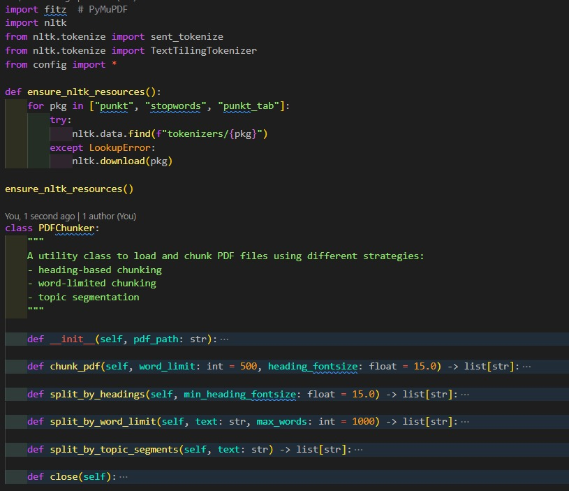

A helper function was developed to extract all page texts from PDF files. This function serves as a core data collection tool for future document-based information retrieval or text-based query systems.

---
* **2. Embedding (Vectorization)**
  
  * **Class:** `GeminiEmbedder`
    
  * The generated text chunks are converted into vectors (embeddings) using the Gemini API.
  * These embeddings are then prepared for storage in the Chroma database. Vectors enable similarity-based access to information.

 

  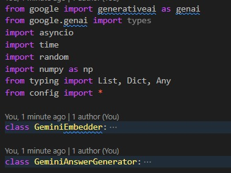

 

  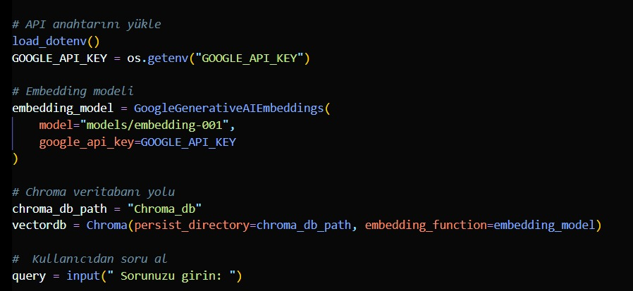

To provide meaningful answers to user queries, the first step of the RAG system—embedding and establishing the vector database connection—was completed. This structure lays the groundwork for the LLM system, which will generate the most relevant answers to user questions in the next step.

---
* **3. Indexing (Saving to the Vector Database)**
  
  * **Class:** `ChromaDBWrapper`
    
  * Each chunk is added to ChromaDB using its ID, text content, and vector representation.
  * For multiple PDF files, the create_index_from_folder() method can be used. At this stage, the knowledge base of the RAG system is constructed.

 

  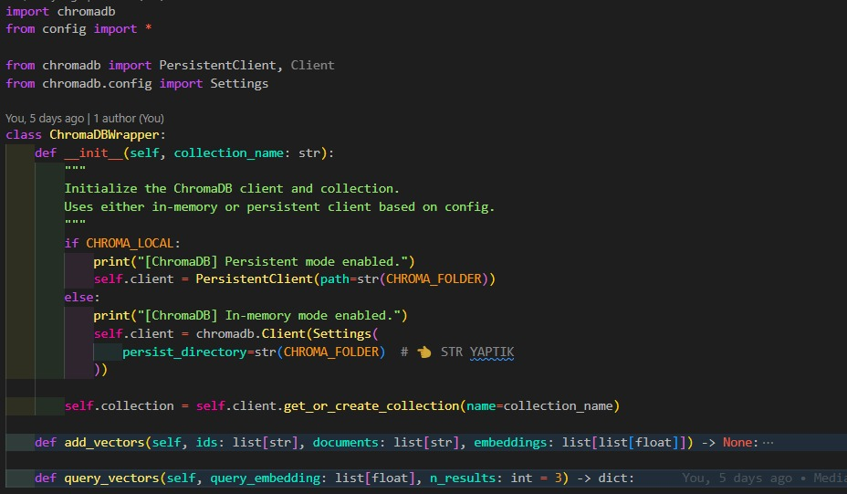

---
* **4. Question Answering**
  
  * **Class:** `RAGPipeline`
    
  * The user's question is embedded and the most relevant chunk(s) are retrieved from ChromaDB (using top_k nearest vectors).
  * These chunks are provided as context to Gemini LLM, which then generates a meaningful answer. If needed, a context-free response can also be generated using the chat() method.

 

  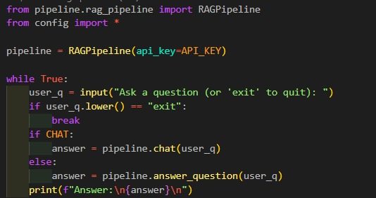

---

 

    
<h3>Frontend</h3>

* **Frontend Developers:**
  * Helin Hümeyra SARAÇOĞLU
  * Hatice Ece KIRIK

The core user interface flow for the MedAI website has been designed around two primary user types: doctor and patient.
* From the homepage, the user clicks the “Doctor Login” button to access the system.
* After login, an identity verification step ensures that only authorized physicians gain entry.
* Based on the patient’s status, the doctor then selects either `Existing Patient` or `New Patient.`

 

  

From this decision point, the system branches into two distinct flows:

* **Existing Patient Flow:** The doctor accesses a list of previously registered patients and views the selected patient’s profile.
* **New Patient Flow:** The doctor fills out a patient registration form to enter new patient information into the system.
In both cases, the physician completes data entry by progressing through the Patient Profile, Detailed Medical History, and Current Complaint sections. Next, they initiate the AI‑assisted diagnostic process by clicking the `AI Analysis` button.

Finally, the analysis results are presented on a dual‑panel evaluation page:
* **Left Panel:** AI‑generated diagnostic suggestions, potential conditions, and recommended tests.
* **Right Panel:** The doctor’s clinical notes, treatment plan, and follow‑up recommendations.

 

  

 

  

This architecture both streamlines the physician’s decision‑making process and provides a systematic review. Clear color‑coding and guiding text have been applied throughout the pages to enhance the user experience.

 

 
 --- 

> **[Click to return to the main file](../../README.md)**
