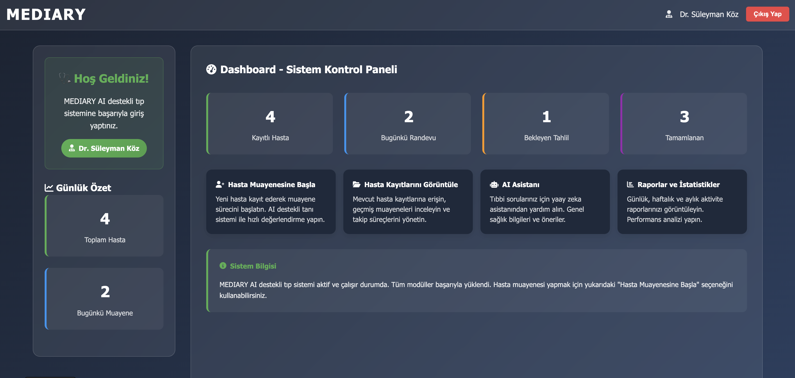

# Sprint 3

* **Sprint Notes:**
  - Implemented a modular, Gemini API-powered RAG (Retrieval-Augmented Generation) system for backend.
  - Built a dynamic and scalable embedding pipeline with batch support and metadata-based conflict prevention.
  - Indexed embedded vectors using ChromaDB and a UUID-based ID structure.
  - Integrated backend with the frontend for seamless PDF uploads and question-answering.
  - Created a `RAGPipeline` class to handle embedding, indexing, and query-answering workflows.
  - Conducted daily Scrum meetings to monitor progress and resolve blockers.

* **Expected point completion within Sprint:** `100 points`

* **Point Completion Logic:** The entire project backlog consists of '300 points'. Dividing this into three sprints, the first sprint was assigned '100 points' of workload. 

* **Daily Scrum:** 
 

  

 

  

 

  

* **Meeting Dates:** `July 22, July 24, July 26, July 29, July 31, August 1, August 2.`

* **Product Backlog URL:**
  
 

  

* **Sprint Review:**
  - Achieved full integration between backend and frontend, enabling real-time PDF processing and user interaction.
  - Users can now upload PDF files and ask questions through the frontend, receiving answers generated via the Gemini API.
  - Backend automatically detects and embeds new documents without reprocessing previously stored content.
  - ID structure enhancement using `"UIID-CHUNKINDEX"` improved indexing accuracy and search efficiency.
  - Embedding infrastructure now supports asynchronous operations, rate-limiting, and exponential backoff for API reliability.
  - Logging and chunk validation mechanisms ensure clean data pipeline and performance visibility.

* **Sprint Review Participants:** `Doğukan Vatansever, Hatice Ece Kırık, Zeynep Atik, Mevlüt Han Aşcı, Helin Hümeyra Saraçoğlu.`
  
* **Sprint Retrospective:**
  - The backend infrastructure was modularized and improved for scalability, incorporating dynamic chunking, batch embedding, and conflict-free indexing.
  - PDF upload, embedding, and question-answering flows were fully integrated with the frontend using Django views and asynchronous endpoints.
  - Improvements in chunking logic and embedding normalization helped resolve previous issues with AI response consistency.
  - Logging mechanisms and chunk count tracking were added to validate pipeline performance and data flow.
  - Team collaboration remained strong, with daily meetings ensuring steady task progress and alignment.
  - Although the backend RAG pipeline became more robust, real-time error feedback and test automation are still areas for future improvement.
  - Initial frontend–backend integration required iterative debugging, highlighting the need for earlier integration testing in upcoming sprints.
  - Logo and visual assets development continued, with refined drafts prepared but finalization postponed to the next sprint due to prioritization of backend stability.
  - Overall, Sprint 3 successfully delivered the system’s core AI functionality and established a reusable backend–frontend communication structure.

 
  ---
 

    
<h3>Backend</h3>

In this sprint, a Gemini API-powered RAG (Retrieval-Augmented Generation) infrastructure was transformed into a modular, Python-based backend system and configured to work seamlessly with the frontend.

The developed system generates contextual answers to user queries based on uploaded PDF documents. These PDFs are split into chunks, embedded via the Gemini API, and added to a vector database structured using ChromaDB.

With these backend integrations, the system not only provides accurate, knowledge-based answers but also establishes a continuously learning structure.

   * **Backend Developers:**
      * Zeynep ATİK
      * Mevlüt Han AŞCI
      * Doğukan VATANSEVER
    
### 1. Chunking

Instead of processing the entire page text at once, PDF documents are divided into meaningful sub-sections called *chunks* to enable more efficient analysis and information extraction. The chunking process is carried out in two main steps:

#### Splitting by Headings (`split_by_headings`)
First, text blocks on PDF pages are analyzed based on font sizes to detect headings. These headings act as separators, allowing the document to be divided into semantically meaningful sections.

This ensures that each heading and the descriptive content beneath it are treated as a single coherent unit.

> **Note:** During heading detection, a font size threshold of `15.0` is used. If a line contains a font size exceeding this threshold, it is identified as a heading.

 

  

#### Splitting by Word Limit (`split_by_word_limit`)

The text blocks obtained from heading-based chunking are further divided into smaller parts based on word count. During this process:

- Each chunk is limited to approximately **500 words**.
- **Sentence integrity is preserved** — splits are not made in the middle of a sentence.
- **NLTK** (Natural Language Toolkit) is used to detect sentence boundaries, rather than relying on token-based methods.

 

  

### Improvements in Chunking Process

In the previous version of the project, some issues were observed with certain PDF files:

- Although headings were correctly identified, content blocks were improperly segmented.
- Long sentences caused the word limit to be exceeded due to incomplete splitting.
- The `split_by_word_limit()` function occasionally produced only one large chunk, leading to inefficiency.

#### Fixes Implemented in This Sprint

- A sentence-based control mechanism was developed.
- Each chunk is now both semantically meaningful and appropriately limited in size.
- Chunk counts were verified through a logging system (e.g., `70+119 chunks success!`).

---

### 2. Embedding

This section explains the structure and working principles of the text embedding infrastructure developed within the scope of the project, along with improvements over the previous version.

The core objective of the system is to convert the text chunks obtained from PDF training data into high-dimensional vectors. These embeddings enable fast and accurate results during similarity-based querying.

The new architecture offers significant advantages in terms of **performance** and **sustainability**.

 

  

### Enhancements in the Embedding Process

#### Key Improvements:

- **Batch Embedding Support:**  
  In the previous version, each text chunk was embedded individually. The new system supports batch processing based on a configurable batch size, significantly improving both speed and resource efficiency.

- **Dynamic Chunk Training:**  
  The system now detects new PDF files inside the `source/` directory and only adds the newly generated chunks to ChromaDB without overwriting previously embedded vectors. This avoids reprocessing the entire dataset and allows incremental updates.

- **Conflict-Free Storage:**  
  Each embedded content is associated with a unique `uuid`, preventing collisions and eliminating the risk of data loss in the database.

- **Time-Based Smart Delay & Rate Limiting:**  
  The `GeminiEmbedder` class supports both synchronous and asynchronous embedding. In case of API rate limits, an exponential backoff mechanism is triggered to automatically increase the delay time.

- **Normalization:**  
  All embedding vectors are normalized using the L2 norm, enhancing the precision of similarity search and improving data quality.

- **Buffer-Based Process Management:**  
  To handle API limitations, buffer intervals and rest durations are introduced, ensuring stability during long-running operations.

#### Core Components Used:

- **`GeminiEmbedder` Class:**  
  The main class responsible for embedding text chunks from PDF files, supporting both individual and batch processing.

- **`embed_chunks()` Method:**  
  The central method that transforms incoming text into vectors, operating in both `async` and `sync` modes.

- **ChromaDB:**  
  A vector database used to store embedded vectors. Contextual search results are retrieved from this database.

Thanks to these enhancements, our embedding system is now **both updatable and scalable**. It can incorporate new user-generated content into the existing embedding database without any data corruption, enabling a more **robust and stable RAG architecture**.

---

### 3. Indexing

After the embedding process, the information chunks extracted from PDF documents are indexed as vectors in **ChromaDB**. To prevent repeated writes and data conflicts for the same document, a **UI ID–based structure** has been integrated into the system.

Thanks to this structure, different uploads or updates by the same user can be distinguished, allowing indexed content to be managed in a controlled and conflict-free manner.

### Enhanced Indexing via `ChromaDBWrapper` Class

The `ChromaDBWrapper` class provides an abstraction layer that supports both **persistent** (`PersistentClient`) and **temporary** (`In-memory`) storage of data. With the integrated UI ID system, every embedding record is associated with a unique identifier. This enables:

- **Automatic Removal of Old Vectors:**  
  If the same file is uploaded again, previously stored vectors are automatically deleted using the `delete_by_prefix(ui_id)` function.

- **Clean Re-indexing:**  
  New vectors are then added cleanly to the same collection using the `add_vectors()` function.

This approach ensures a clean and reliable indexing process, enhancing the system's ability to handle updates and repeated uploads effectively.

 

  
  
<em>Each ID is now generated in the format <code>"UIID-CHUNKINDEX"</code>, making it easy to filter and manage all data associated with a specific user or document.</em>

---

### 4. Question Answering

To provide meaningful, context-aware, and accurate answers to user queries, the project utilizes a **RAG (Retrieval-Augmented Generation)** architecture. This design allows large language models (LLMs) to integrate with external data sources, enabling more reliable and up-to-date responses.

The system stores the vector representations of information chunks extracted from PDF documents in **ChromaDB**. When a user submits a query, the system retrieves the most relevant chunks and generates an answer based on that content.

The architecture is structured around a central class called **`RAGPipeline`**, which brings together the following modules:

 

  

---
### 5. Integration

#### Backend–Frontend Integration Process

In this sprint, the RAG-based backend infrastructure was configured to seamlessly integrate with the frontend interface. When a user uploads a PDF file via the frontend, it is automatically processed and embedded into the **ChromaDB** vector database by the backend.

#### Core Integration Workflow:

- **File Upload via Frontend:**
  - When a user uploads a new PDF, it is saved to the `source/` directory on the backend.

- **Automatic Processing and Indexing:**
  - The backend script scans all new PDF files.
  - Previously processed files are moved to avoid redundant training.
  - New PDFs are chunked based on word limits, embedded, and stored in ChromaDB with relevant metadata (e.g., `UI_ID`).

- **Question-Answer Functionality:**
  - User queries sent from the frontend are forwarded to the backend.
  - The system retrieves the most relevant chunks and generates an answer using the **Gemini API**.
  - The generated response is then returned to the frontend and displayed to the user.

#### Objectives:

- Allow users to ask questions immediately after uploading a PDF.
- Process only new documents without re-embedding previously handled files.
- Ensure all frontend requests are handled reliably by the backend.

---

  
<h3>Frontend</h3>

In this sprint, the frontend interface of the Mediary system was designed and implemented to provide a smooth, intuitive, and responsive user experience for medical professionals.

The system allows doctors to log in, register patients, conduct structured medical examinations, and interact with AI-powered diagnostic tools through a modern web interface.

Each step of the examination workflow—interview, test request, AI analysis, and prescription—is supported with clearly designed pages and seamless backend communication. The UI was carefully structured to ensure responsiveness across all devices and to enable real-time interaction with the underlying RAG-based AI system.

Key components such as the doctor login screen, patient registration forms, dynamic dashboards, and an embedded AI chatbot were all developed and integrated during this sprint, ensuring a complete end-to-end experience from data input to intelligent diagnosis delivery.

---

## 🩺 Features

### 🔹 Core Features
- **🧠 AI-Based Diagnosis System**: Suggests possible diagnoses based on patient complaints and lab results using AI.
- **📋 Patient Management**: Complete system for patient registration, history tracking, and follow-up.
- **🔄 Examination Workflow**: Step-by-step digital examination flow with four structured stages.
- **💊 Prescription Creation**: Allows doctors to create, preview, and print digital prescriptions.
- **🤖 AI Chatbot**: Built-in assistant for answering general medical questions using natural language.
- **📱 Responsive Design**: Fully optimized for mobile phones, tablets, and desktop screens.

---

 

  

 

  

## 👨‍⚕️ Demo Users

The system comes with predefined demo users:

| Username  | Password  | Doctor Name               | Specialty            |
|-----------|-----------|---------------------------|----------------------|
| skoz      | doktor123 | Prof. Dr. Süleyman Köz    | Cardiology           |
| ademir    | hekim456  | Dr. Ayşe Demir            | Internal Medicine    |
| myilmaz   | tip789    | Dr. Mehmet Yılmaz         | General Practitioner |
| admin     | admin123  | Admin User                | System Administrator |

 

  

---

## 🩻 Examination Workflow

1. **📝 Initial Patient Interview**  
   Logging of complaints and doctor’s notes

2. **🧪 Lab Test Request**  
   AI-suggested diagnostic tests based on symptoms

3. **📊 AI Interpretation**  
   AI-powered analysis of lab results

4. **💊 Prescription & Outcome**  
   Final diagnosis, prescription generation, and medical recommendations

## 📱 Usage

### Logging In
1. On the homepage, click the **"Doctor Login"** button  
2. Use one of the demo credentials or enter your own login details  
3. Access the system dashboard  

### Patient Examination
1. On the dashboard, click **"Start Patient Examination"**  
2. Select an existing patient or use **"New Patient Registration"** to add one  
3. Follow the 4-step examination process:
   - Record the patient's complaint  
   - Select the required tests  
   - Wait for the AI analysis  
   - Generate the prescription and recommendations  

### AI Assistant
- Use the AI chatbot located at the bottom-right corner to ask general medical questions  
- You can choose from predefined questions or type your own inquiries  
---

 

  

 

  

 

  

 

  

## 🗄️ Database Models

### 🧑‍⚕️ Doctor
- One-to-One relationship with Django `User` model  
- Medical specialty  
- License number  

### 🧍 Patient
- Personal information (name, national ID, age, gender)  
- Medical history  
- Allergy details  
- Blood type  

### 📝 Examination
- Relation between patient and doctor  
- Complaint records  
- Diagnosis information  
- Prescription and medical recommendations  

### 🧪 TestRequest
- Linked to an examination  
- Test name and priority  
- AI suggestion status  

## 🏗️ Project Structure

 

  

### ⚙️ Technical Specifications

- Django 4.2.7 framework  
- SQLite database  
- Django authentication system  
- AJAX API endpoints  
- Responsive design using CSS Grid and Flexbox  
- Font Awesome icon set  

## 🎨 Design Features

- **Modern UI/UX**: Gradient backgrounds and glassmorphism effects  
- **Responsive**: Mobile-first design approach  
- **Animations**: CSS3 transitions and hover effects  
- **Color Palette**: Medical theme (shades of blue, green, and white)  
- **Typography**: Segoe UI font family  
- **Icons**: Font Awesome 6.0  

---

## 🔒 Security

- Built-in Django Authentication system  
- CSRF protection  
- Session-based authentication  
- SQL Injection protection (via Django ORM)  
- XSS protection  
- Secure form validation  
- Password hashing mechanism  

**Frontend Developers:**
  * Helin Hümeyra SARAÇOĞLU
  * Hatice Ece KIRIK
---

---

  
<h3>Road Map</h3>

## Development Roadmap

### v1.1 (Upcoming Release)
- **PDF Export** – Print prescriptions and medical reports  
- **Database Integration** – Support for MySQL/PostgreSQL  
- **API Integration** – RESTful API support  
- **User Authentication** – Login/Logout system  

### v1.2 (Mid-Term)
- **Real AI Integration** – OpenAI or custom ML model integration  
- **Patient Appointment System** – Calendar and scheduling support  
- **E-Nabız Integration** – Turkish Ministry of Health data sync  
- **Multi-language Support** – English interface support  

### v2.0 (Long-Term)
- **Hospital Management System** – Multi-doctor and multi-department support  
- **Lab Results Integration** – Automated lab data synchronization  
- **Mobile Application** – React Native app for iOS and Android  
- **Blockchain Integration** – Secure data storage and verification  

 

  

  

  

  

 

> ⚠️ **Note**: This system is for **demonstration purposes only** and is **not suitable for real medical use**.  
> Always consult a qualified physician for medical decisions.
 --- 

> **[Click to return to the main file](../../README.md)**
